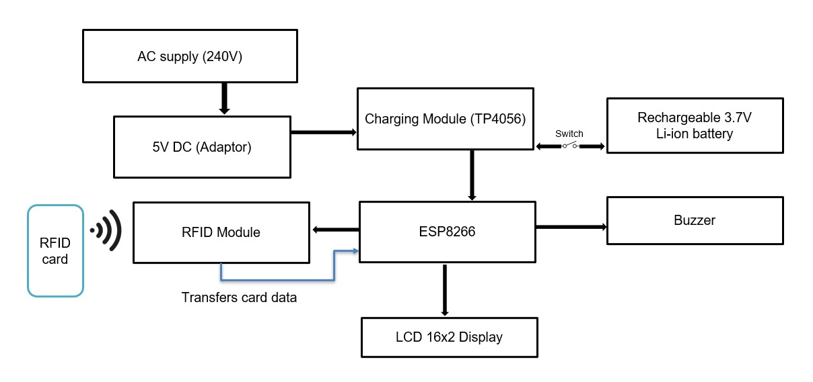
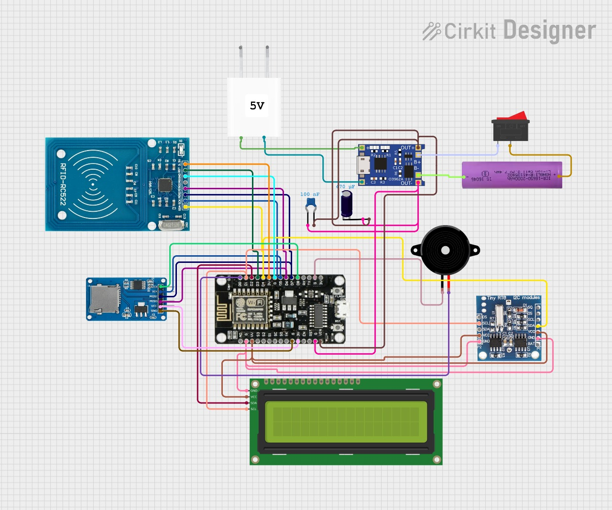
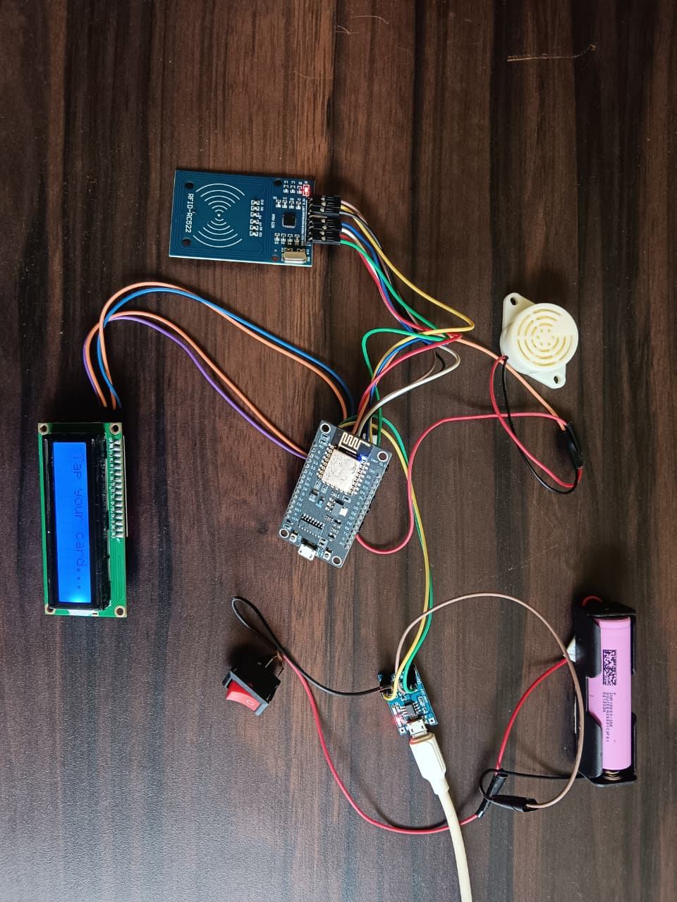
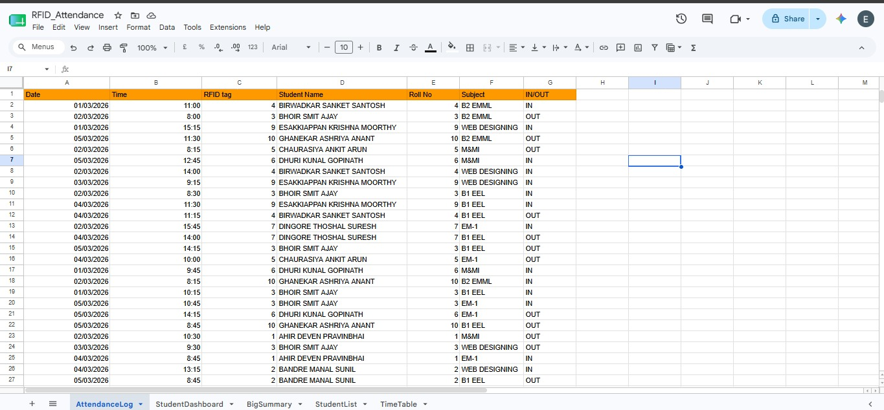
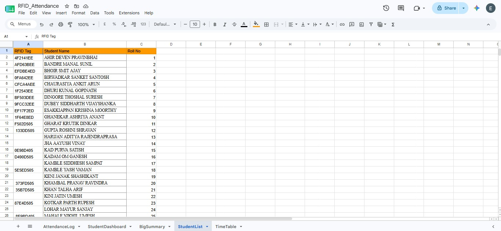
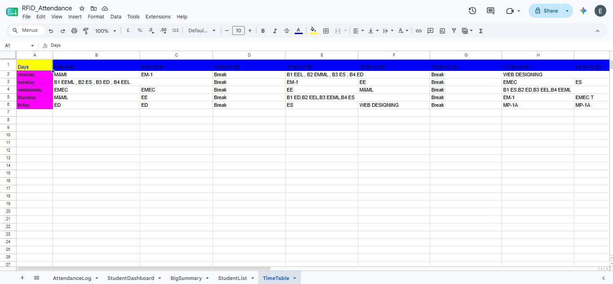

# Smart Attendance System Based on RFID

An IoT-based attendance management system that uses RFID technology and ESP8266 NodeMCU to automate attendance recording and store data in Google Sheets for real-time monitoring and analysis.

## Overview

Traditional attendance systems are time-consuming and prone to errors. This project provides an automated solution using RFID cards and wireless communication. When a registered RFID card is scanned, the system records attendance instantly and uploads the data to Google Sheets through Wi-Fi.

## Features

* RFID-based attendance authentication
* Real-time attendance recording
* Wi-Fi enabled cloud synchronization
* Google Sheets integration
* LCD display for user feedback
* Buzzer notification for successful scans
* Rechargeable battery backup support
* Low-cost and scalable design

## Hardware Components

| Component              | Description                     |
| ---------------------- | ------------------------------- |
| ESP8266 NodeMCU        | Main microcontroller            |
| RC522 RFID Reader      | Reads RFID cards/tags           |
| RFID Cards             | User identification             |
| LCD 16x2 I2C Display   | Displays system status          |
| Buzzer                 | Audio indication                |
| TP4056 Charging Module | Battery charging and protection |
| 18650 Li-ion Battery   | Backup power source             |
| 5V Adapter             | Primary power supply            |

## Software Stack

* Arduino IDE
* ESP8266 Libraries
* MFRC522 Library
* Google Apps Script
* Google Sheets

## System Workflow

1. RFID card is scanned using the RC522 RFID reader.
2. ESP8266 reads the unique RFID card ID.
3. The system validates the scanned card.
4. Attendance data is transmitted through Wi-Fi.
5. Google Apps Script processes the received data.
6. Attendance records are stored automatically in Google Sheets.
7. LCD display and buzzer provide immediate user feedback.

## Block Diagram

---

## Circuit Diagram

---

## Hardware Setup

---

## Attendance Log

---

## Student List

---

## Timetable

---

## Applications

* Educational Institutions
* Training Centers
* Offices and Workplaces
* Laboratories
* Event Attendance Tracking

## Future Improvements

* Mobile Application Integration
* Firebase Database Support
* Face Recognition Authentication
* Attendance Analytics Dashboard
* Multi-Classroom Deployment

## Author

**Satyam Singh**

## License

This project is licensed under the MIT License.
